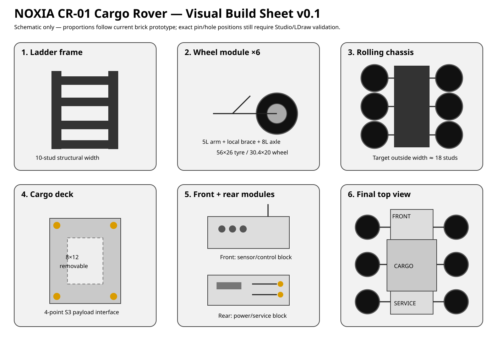

# NOXIA CR-01 · Visual Instructions v0.1

Status: **schematic visual construction guide — not yet Studio/LDraw validated**  
Parent build: `brick-prototype-cargo-rover-cr01-build-v01.md`  
Text instructions: `brick-prototype-cargo-rover-cr01-instructions-v01.md`

## Reading the sheet

The build sheet compresses the current construction into six visual checkpoints:

1. **Ladder frame** — two longitudinal Technic rails tied by four cross-members/frames.
2. **Wheel module ×6** — identical basic arm, brace, axle, hub and 56×26 tyre assembly.
3. **Rolling chassis** — all six wheel modules installed; this is the first stance and clearance gate.
4. **Cargo deck** — removable 8×12 payload module with four visible S3 corner/interface points.
5. **Front + rear modules** — sensor/control block ahead of cargo; power/service block behind it.
6. **Final top view** — intended hierarchy and silhouette after limited external skin is added.

## Important limitation

These diagrams show **assembly relationships and proportions**, not authoritative Technic hole coordinates. The following remain provisional until a Studio/LDraw build exists:

- exact rail-overlap holes,
- exact mounting hole for each 5L wheel arm,
- brace angle/hole choice,
- final S3 bracket/pin geometry,
- exact side-panel bracket geometry.

The visual guide is therefore suitable for understanding and trial-building the prototype, but it must not yet be treated as a production instruction booklet.

## Validation workflow

During a physical trial build, record deviations directly against these checkpoints:

- Gate A — bare ladder frame is rigid enough to lift without major torsional twist.
- Gate B — six tyres contact a flat surface and rotate without chassis rub.
- Gate C — 8×12 cargo deck removes as one piece without disturbing wheels or rails.
- Gate D — front reads as machine sensor/control equipment rather than a car cockpit.
- Gate E — rear service block detaches separately from the cargo module.
- Gate F — completed rover retains visible dark structure and a clearly industrial silhouette.

Any geometry correction discovered during these gates feeds back into the CR-01 BOM and the Brick Design Standard v0.2.
